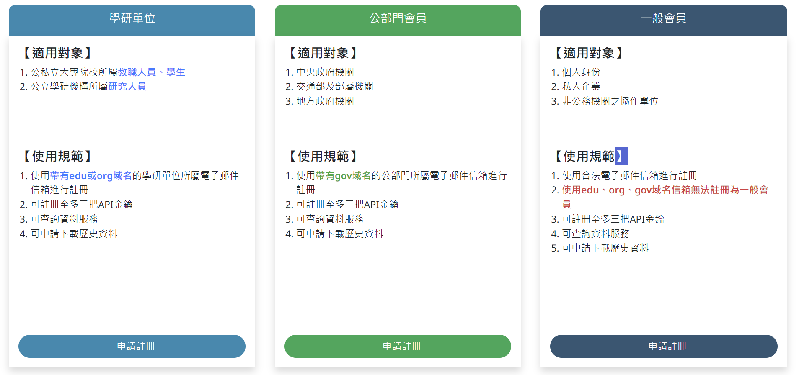
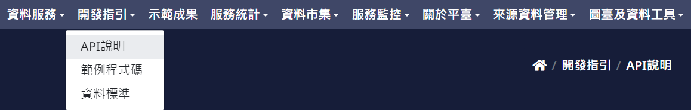
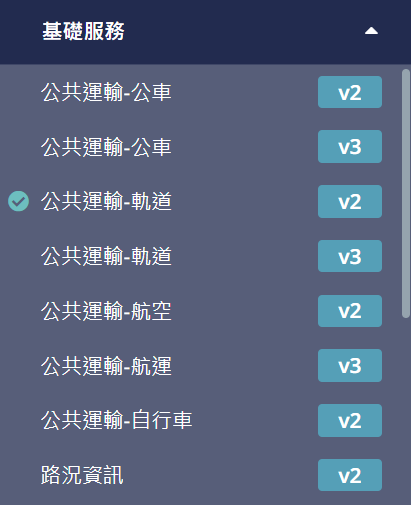
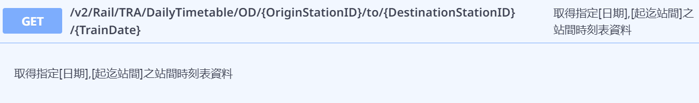
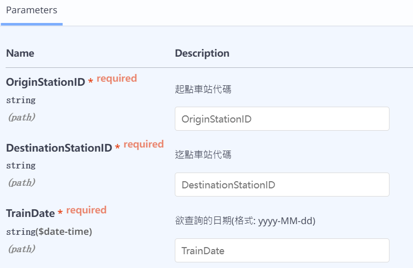
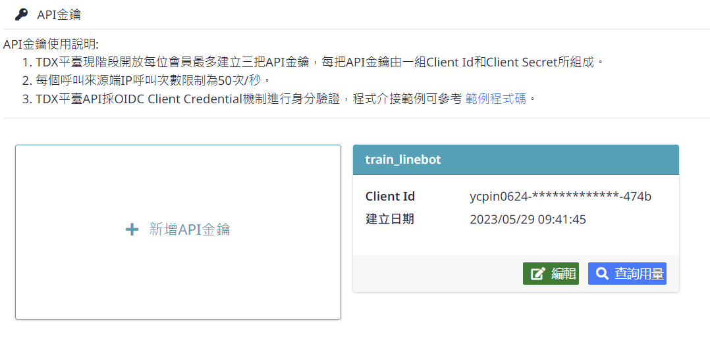
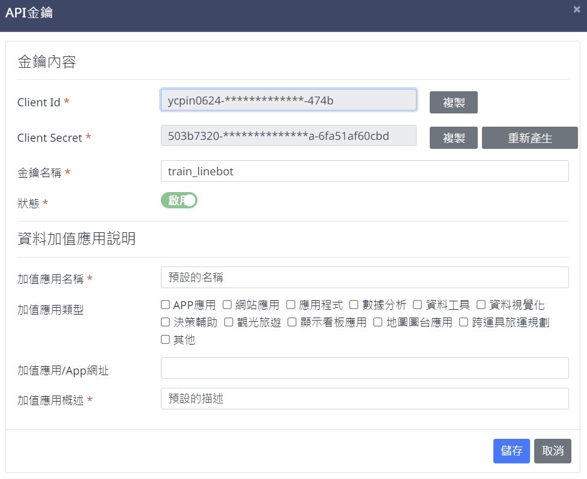

# Transport Data eXchange (TDX) API Tutorial and Demonstration

- targets: TDX tutorial and demonstration by python program.

Transport Data eXchange (TDX)
---

- 交通部為積極落實智慧運輸政策，加速運輸資料整合與開放，創建發展「運輸資料流通服務平臺」(Transport Data eXchange, TDX)，該平臺以資訊代理站作為定位，提供單一平臺以利使用者快速尋找各類型資料。期透過 Open API 服務之整合，建立運輸領域開放資料的 Transport Open API Portal，讓使用者可從單一介面快速查找並即時獲取所需資料。
- 平臺中的 API 為依資料標準轉化後以 OData (Open Data Protocol) 標準介面提供高品質、開放資料達四星級之公共運輸旅運資料服務 API。其資料服務供應範疇涵蓋全國尺度之公路、軌道、航空、航運、自行車、路況、停車、圖資、道路路段編碼、觀光等交通運輸動靜態資料，未來將持續擴增。

註冊帳號
---

- 學研單位：使用帶有 edu 或 org 域名之電子郵件信箱進行註冊
- 公部門帳號：使用帶有 gov 域名之電子郵件信箱進行註冊
- 一般帳號：使用合法電子郵件信箱進行註冊，無法使用 edu、org、gov 域名信箱註冊



資料 API
---

資料範例：指定[日期][起迄站間]之**臺鐵**站間時刻表資料

1. 點選 開發指引 -> API 說明

    

2. 選擇查找資料主題 基礎服務 -> 公共運輸-軌道 v2

    

3. 點選 臺鐵 -> 選擇指定資料

    
    
4. 查詢方法：輸入起終點 StationID(車站代碼) 與 TrainDate(查詢時間)

    

StationID
---

臺鐵所有車站之名稱與代碼，輸出為 `trainCode.csv`

```bash=
python3 src\trainCode.py
```

調用 API
---

1. 會員中心 -> API金鑰數量 -> 申請金鑰

    

2. API 金鑰資料

    
    
- `Client Id` 與 `Client Secret` 為呼叫 API 的驗證資料

3. 修改金鑰後，執行查詢範例程式 `src\ptx_info.py`

    ```python3
    import requests
    from pprint import pprint
    import json

    # replace to your ID
    app_id = 'XXXXX-XXXXXXXX-XXXX-XXXX'
    app_key = 'XXXXXXXX-XXXX-XXXX-XXXX-XXXXXXXXXXXX'

    OriginStationID = "3300" # 臺中
    DestinationStationID = "3360" # 彰化
    TrainDate = "2023/08/20" # 查詢日期

    auth_url="https://tdx.transportdata.tw/auth/realms/TDXConnect/protocol/openid-connect/token"
    url = "https://tdx.transportdata.tw/api/basic/v3/Rail/TRA/DailyTrainTimetable/OD/{0}/to/{1}/{2}$format=JSON".format(OriginStationID, DestinationStationID, TrainDate)

    class Auth():

        def __init__(self, app_id, app_key):
            self.app_id = app_id
            self.app_key = app_key

        def get_auth_header(self):
            content_type = 'application/x-www-form-urlencoded'
            grant_type = 'client_credentials'

            return{
                'content-type' : content_type,
                'grant_type' : grant_type,
                'client_id' : self.app_id,
                'client_secret' : self.app_key
            }

    class data():

        def __init__(self, app_id, app_key, auth_response):
            self.app_id = app_id
            self.app_key = app_key
            self.auth_response = auth_response

        def get_data_header(self):
            auth_JSON = json.loads(self.auth_response.text)
            access_token = auth_JSON.get('access_token')

            return{
                'authorization': 'Bearer '+access_token
            }

    if __name__ == '__main__':
        try:
            d = data(app_id, app_key, auth_response)
            data_response = requests.get(url, headers=d.get_data_header())
        except:
            a = Auth(app_id, app_key)
            auth_response = requests.post(auth_url, a.get_auth_header())
            d = data(app_id, app_key, auth_response)
            data_response = requests.get(url, headers=d.get_data_header())    
        print(auth_response)
        pprint(auth_response.text)
        print(data_response)
        pprint(data_response.text)
    ```

資料來源
---

[「運輸資料流通服務平臺」(Transport Data eXchange, TDX)](https://tdx.transportdata.tw/)
